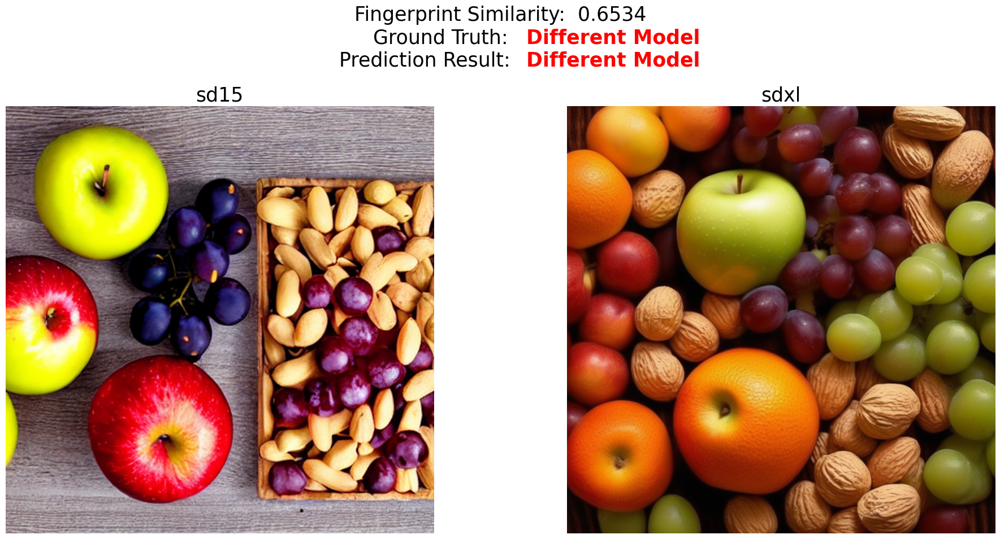

# Model-Fingerprint
This is the code for the paper "Model Synthesis for Generalized Model Attribution". In this paper, we train a model fingerprint extractor based on a large number of synthetic models that mimic the fingerprint patterns of real-world generative models. The fingerprint extractor generalizes well on real-world generative models in the open enrironment that are not included in training.

## Train Model Fingerprint Extractor Based-on Synthetic Models

- Prepare:
    1. Synthetic models: We construct 5760 synthetic models with 288 architectures.
    2. Real image datasets: We use real image datasets and synthetic models to generated fingerprinted images. The real image datasets are formed by CelebA and LSUN (20 classes). 
    
    The utilized synthetic models and real image dataset will be released in the future.

- Train the model fingerprint extractor based on synthetic models:
    ```
    sh ./script/do_train.sh
    ```
    

- Our fingerprint extractor trained on synthetic models is here: [Fingerprint Extractor](https://drive.google.com/file/d/1LzFxuMWez9PBP0rYXiH6DKkZJCKFXEZO/view?usp=sharing). Put it into the directory ``./weights``


## Evaluation

### Evaluated Real Models

The dataset is constructed as follows:
```
Dataset
├── CNN
│   ├── Diffusion
│   │   └── lsun_bedroom
│   │       ├── ADM
│   │       ├── DDPM
│   │       ├── LDM
│   │       └── PNDM
│   ├── Flow
│   │   └── celeba
│   │       ├── glow
│   │       └── ResFlow
│   ├── GAN
│   │   ├── celeba
│   │   │   ├── AttGAN
│   │   │   ├── MMDGAN
│   │   │   ├── ProGAN
│   │   │   ├── SNGAN
│   │   │   └── starGAN
│   │   └── Faces_HQ
│   │       ├── ProGAN
│   │       ├── styleGAN
│   │       ├── styleGAN2
│   │       ├── styleGAN3_r
│   │       └── styleGAN3_t
│   └── VAE
│       └── celeba
│           ├── BetaVAE
│           ├── DisBetaVAE
│           ├── InfoVAE
│           └── VanillaVAE
├── Transformer
│   ├── celeba
│   │   ├── Styleformer
│   │   └── TransGAN
│   └── ffhq
│       ├── gansformer
│       └── StyleSwin
└── T2I
    ├── dalle_2
    ├── dalle_3
    ├── dalle-mini
    ├── glide
    ├── midjourney_kaggle
    ├── stable_diffusion_v15
    ├── stable_diffusion_v21
    └── stable_diffusion_xl
```
<!-- You could download here: [Real Model Dataset]().  -->
The full dataset will be released in the future.

We provide a small subset of this dataset, with each category containing 50 samples. You could download here: [Subset](https://drive.google.com/file/d/1-UT0c_0T7gOx2X2mVxkRtpznNt4zW7Zd/view?usp=sharing). Put it into the directory ``./dataset``

### 1:1 Model Verification 

- This task verifies whether two images are from the same models. 
- Evaluation script for 1:1 model verification:
    ```
    sh ./script/do_test_1v1.sh
    ```
### 1:N Model Identification

-  This task identifies the specific generative model used to create a given image among N models. 
- For each model, we use 10 samples to construct the fingerprint for this model in the gallery, and use the rest as testing samples. We compare the testing samples with every fingerprint in the gallery to identify its source model.

- Evaluation script for 1:N model identification:
    ```
    sh ./script/do_test_1vN.sh \
    ```

## Evaluation Demo


[demo.ipynb](demo.ipynb) 


In this demo, we provide some model verification results produced by our model fingerprint extractor. The fingerprint extractor is solely trained on synthetic models, without having been trained by images from real-world generative models.

Some of the cases are shown below.


The above two images are collected [here](https://civitai.com/models/212532/all-disney-princess-xl-lora-model-from-ralph-breaks-the-internet).
They are generated by a LoRA model based on RealCartoon-XL-v2.


The first image is collected [here](https://civitai.com/models/212532/all-disney-princess-xl-lora-model-from-ralph-breaks-the-internet).

The second image is collected [here](https://civitai.com/models/332276/elsa-frozen-sd15sdxlponysdxl-commission).


The two images are generated by DallE-3 in ChatGPT

Prompt1: An armchair in the shape of an avocado

Prompt2: "A sea otter with a pearl earring" by Johannes Vermeer


The first image is from the show cases on [Dalle-2 webpage](https://labs.openai.com/). The second image is generated by DallE-3 in ChatGPT. 

Both generated by the prompt: An armchair in the shape of an avocado


The first image is from the show cases on [Dalle-2 webpage](https://labs.openai.com/). The second image is generated by DallE-3 in ChatGPT. 

Both generated by the prompt: "A sea otter with a pearl earring" by Johannes Vermeer



The first image is generated by SD15, the second SDXL.

Both generated by the prompt: Two apples, an orange, some grapes and peanuts.


Both generated by SDXL.

Prompt1: Two apples, an orange, some grapes and peanuts.

Prompt2: Stark white appliances stand out against brown wooden cabinets.
